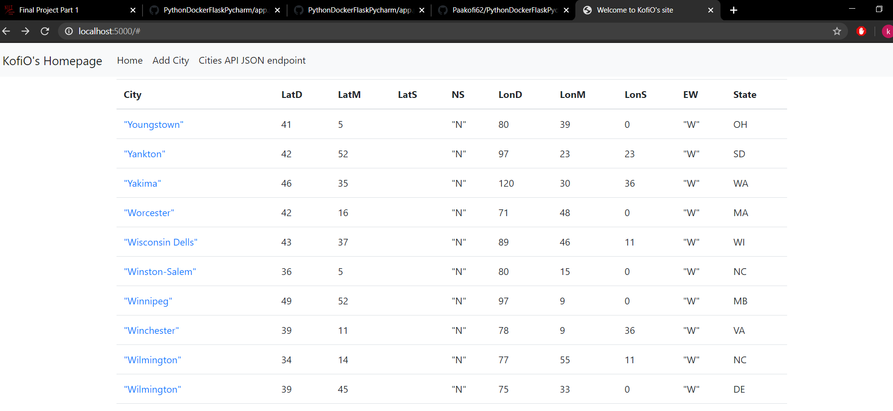
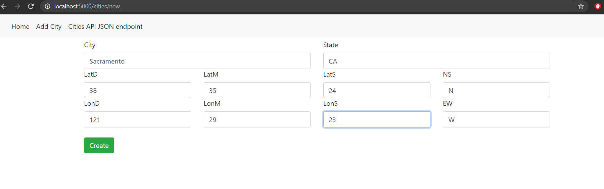
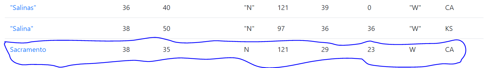
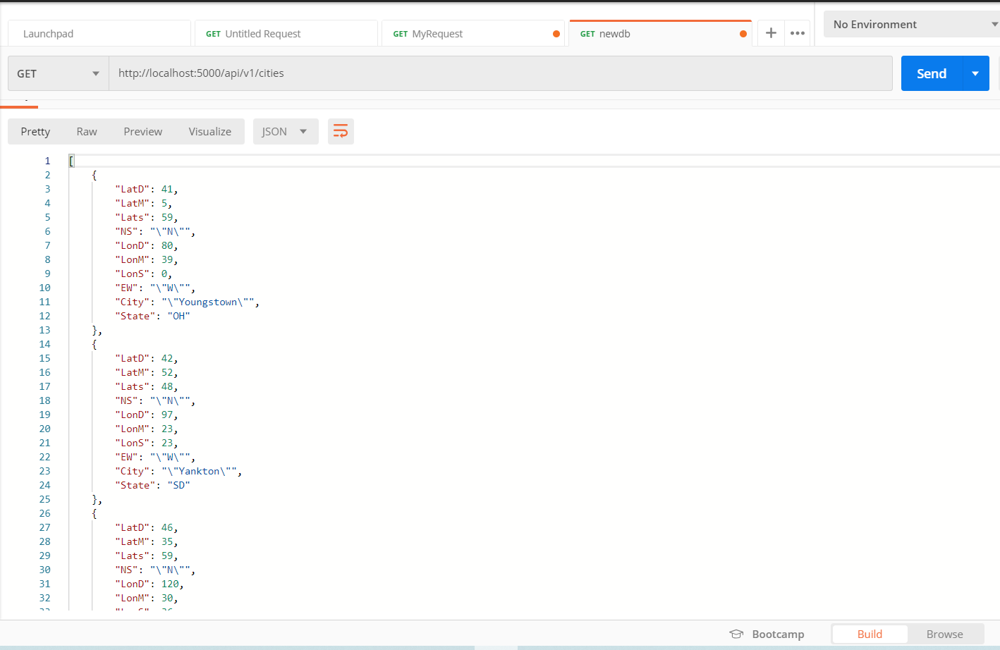

# Project Description
This project is a homework assignment to teach how to get Pycharm setup with Docker, Flask, MySQL, and Postman

# Final Project part 1
# New datatable in pycharm

# New datatable in chrome

# New record added

# Updated record added to homepage

#Final project part 2
# Data in postman

